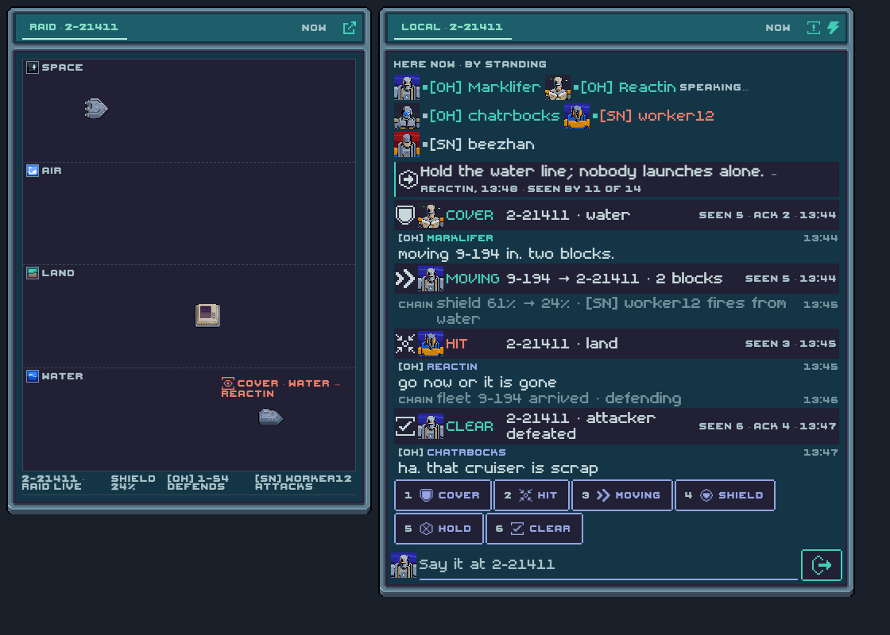
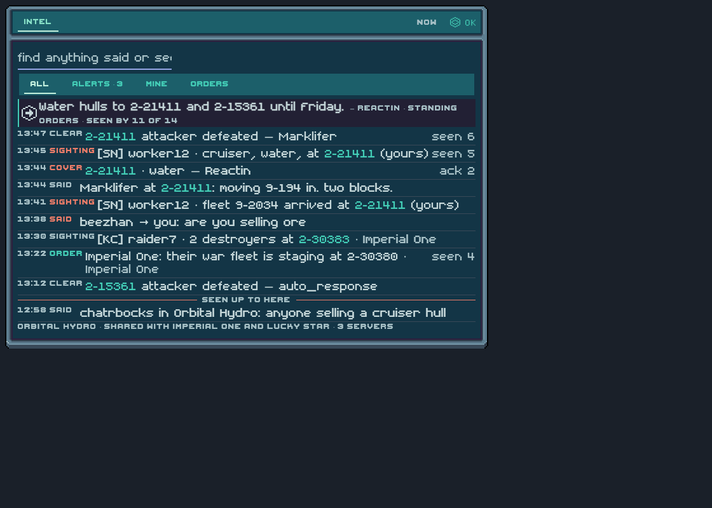
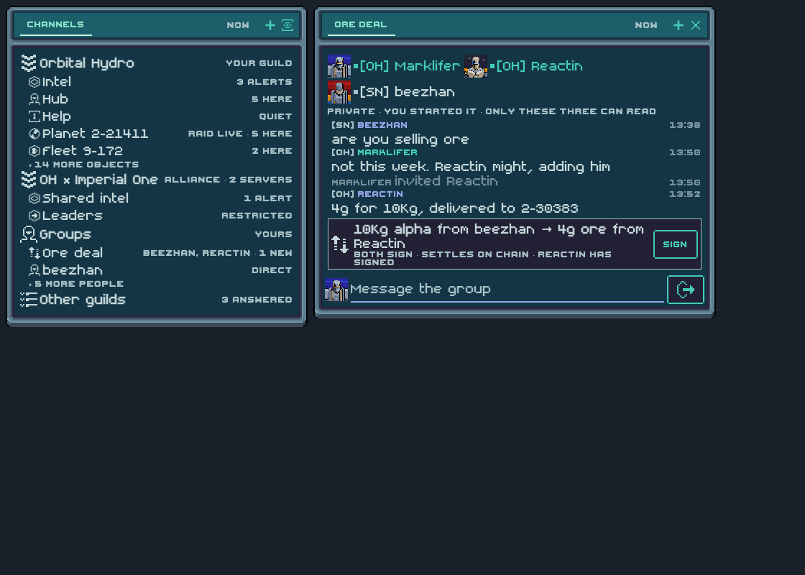

> **Superseded 2026-09-10.** Judged "trying too hard". Decision: Comms is the existing window with direct messages and group chats; the Terminal keeps no Comms cards and its ⌘K words open the window (`matrix_open`). Kept for the prior-art notes and the Matrix map.

# Comms, round 2 — Local · Broadcasts · Intel · Groups

Round 1 (`comms-paradigms.md`) drew four paradigms out of our own architecture
and none of them felt intuitive. This round starts from the other end: what do
players already know from games like this, and what does Matrix — a federated
protocol with rooms, spaces, presence, receipts, custom events and power
levels — already give us to build it on. Nothing here is built. Three screens,
drawn in the game's components; a Matrix map; a build order if you pick it.

## The four words

| Word | What it is | Stolen from | Replaces |
|---|---|---|---|
| **Local** | Every object's conversation, opened with *who is here, by standing*, then standing orders, then broadcasts, chain notices and talk in one timeline. The raid rail *is* Local. | EVE Local (a member list people watch more than they read) | ROOM, WHO, the raid rail |
| **Broadcasts** | A fixed vocabulary — cover · hit · moving · shield · hold · clear — one key each on the raid view. Structured, so bots and vplayers can send and read them. Each shows *seen N · ack M*. | EVE fleet broadcasts, MOBA pings | the freeform "say one thing" as the *only* voice |
| **Intel** | The guild's feed: sightings, broadcasts, orders and what was said, with tabs all · alerts · mine · orders, search on top, and a "seen up to here" rule. Federated to allied guilds. | Ingress COMM, EVE intel channels | COMMS list, FIND, the Terminal door |
| **Groups** | A private room with any set of players across servers, started from a person card. Deals live in it. | Subterfuge / Neptune's Pride | the DM section, ad-hoc "talk to these three" |

**Channels** stays as a word but becomes the guild *space* tree: the guild, its
suggested rooms, its objects, alliance spaces, your groups, other guilds.

## The screens

### Local, on the raid view

Members first, coloured by standing, presence dot, "speaking…" from typing.
Then the standing orders (the room's pinned message from someone with power),
with how many have seen it. Then the timeline: broadcasts are strips with the
sender's portrait and a seen/ack count; chain events are the quiet lines they
already are; talk is talk. Six keys under the list, then the composer. On the
stage, the latest broadcast is drawn where it points — a *cover · water* at the
water ambit.

### Intel

The Ingress COMM shape: everything, alerts (touches your objects or names you),
mine, orders. The standing orders sit at the top. Sightings come from the app
itself — when GRASS shows an enemy fleet arriving at a friendly planet, the app
posts a sighting as the player, so the guild's feed fills without anyone typing.
Rows from allied guilds carry the guild's name. The caption says who shares it.

### Groups and the space tree

Left: the guild as a space — suggested rooms, then objects with life in them,
then the alliance space, then your groups, then other guilds. Right: a group
of three across two servers, with a deal row that both parties sign; that is
the existing work-offer / agreement machinery wearing a plainer face.

## The Matrix map

| Design element | Matrix primitive | In Rust today |
|---|---|---|
| Local's member list, by standing | room membership + `m.presence` + typing; standing from our own lists | yes (presence, typing, members) |
| Standing orders | pinned event by a user with power level ≥ 50, or `m.room.topic` | pins yes; power levels read yes |
| Broadcasts | custom event `structs.broadcast {kind, object, ambit}` with a text `body` fallback so any Matrix client reads "▲ COVER 2-21411 · water" | pattern exists (`structs.work`); type missing |
| seen N · ack M | read receipts (`m.receipt`) + a reaction with a fixed key | receipts parsed yes; reactions yes |
| Chain notices in Local | `m.notice` from the guild bot (infra already names rooms via a bot) | rendered yes; posting is an infra ask |
| Sightings | custom event `structs.sighting` posted by the app from GRASS | missing |
| Intel room | a space child with `suggested: true`; allied guilds invited → federation | space child/parent types known; `/hierarchy` missing |
| Channels tree | `/hierarchy` of the guild space; `suggested` replaces `home_rank` | missing |
| Alliance rooms | `join_rules: restricted` allowing members of the allied space | join rules read yes |
| Groups | private invite-only room, federated | `matrix_dm` yes; multi-invite missing |
| Deals | `structs.work` / agreement events | yes |
| Mentions-only / mute | per-room push rules, server-side | push rules read yes; write missing |
| Kick / ban / topic | power-level gated state events | kick/ban present in client.rs, no surface |
| After-action | `m.thread` on the raid's opening broadcast | model yes; nothing draws it |

## What this keeps and what it overturns

Kept: select-then-act on a message with the same keys; person-card DMs; the
Terminal words (`SAY`, `ROOM` → Local, `FIND` → Intel search); the 8px
captions; the shared chat row.

Overturned, if picked: the raid rail stops being read-and-say-one-thing and
gains the six broadcast keys; mentions-only moves from local state to server
push rules; "Pinned" stops being `home_rank` and becomes suggested rooms of the
space; COMMS/ROOM/CHANNELS/FIND/WHO become Local/Intel/Channels (three cards,
not five).

## Build order, if you pick it

1. **Local + Broadcasts.** The ROOM card becomes Local (members by standing on
   top, orders strip, broadcast rows). Rust: send/parse `structs.broadcast`;
   `auto_defend` honours *cover*; vplayers emit *moving*. The raid rail gets
   the six keys. One build.
2. **Intel.** The guild's intel room, sightings from GRASS, tabs, seen-by on
   orders. The Terminal door becomes "Intel · N".
3. **Channels as the space tree.** `/hierarchy`, `suggested`, alliance spaces.
4. **Groups** from the person card; deals reuse work/agreement.
5. **Push-rule sync**, moderation verbs behind power levels, threads for
   after-action.

Three things need a decision from you before step 1: the broadcast vocabulary
(six words above, or yours), whether to ask guild infra for a bot that posts
chain events as notices into object rooms, and whether allied-guild sharing is
a leader-only act.
